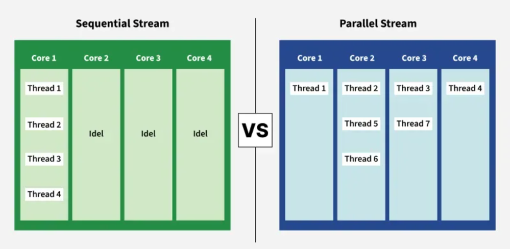

# What is Java Parallel Streams?
Java Parallel Streams is a feature of Java 8 and higher, meant for utilizing multiple cores of the processor. 
Normally any Java code has one stream of processing, where it is executed sequentially. 
Whereas by using parallel streams, we can divide the code into multiple streams that are executed in parallel 
on separate cores and the final result is the combination of the individual outcomes. 
The order of execution, however, is not under our control.

# Where **Not to Use** Parallel Streams ?
* use parallel streams in cases where no matter what is the order of execution, 
* the result is unaffected and 
* the state of one element does not affect the other as well as the source of the data also remains unaffected. 

# Where **To Use** Parallel Streams ?
* Parallel streams are best used when the order doesn’t matter, 
* elements don’t depend on each other, and data remains unchanged.

> [!IMPORTANT]
> Parallel streams enable **large-scale data processing tasks** to be handled **more efficiently** 
> by **utilizing the full power of multi-core processors**

## Difference between Sequential Streams and Parallel Streams:

## Sequential vs Parallel Streams : Main Difference
* **Sequential Streams:** Process elements in a sequential manner, one element at a time
* **Parallel Streams:** Process elements in parallel, utilizing multiple CPU cores.

* Why Parallel Streams?
Parallel Streams improve performance by utilizing multiple cores, but they aren’t always the best choice. 
* In cases where the task requires a specific order of execution, 
* sequential streams are more reliable, even if it means sacrificing performance. 
* The performance gain from parallel streams is significant only for large-scale or computationally intensive programs. 
* For smaller tasks, the difference may be negligible. 
* Use parallel streams primarily when the sequential stream behaves poorly.

How to Create and Use Parallel Streams
There are two main ways to create parallel streams in Java:

1. Using the parallel() Method
   The parallel() method is used on an existing sequential stream to convert it into a parallel stream. This method return a parallel stream, which can then be processed using various stream operations.

Example: This example demonstrates how to use a parallel stream to filter and print even number from a list concurrently.

    // Java Program to demosntrate
    // the working of parallel stream
    import java.util.Arrays;
    import java.util.List;
    
    public class Geeks {
    public static void main(String[] args)
    {
    List<Integer> numbers
    = Arrays.asList(1, 2, 3, 4, 5, 6, 7, 8, 9, 10);
    
            // Convert to parallel stream and perform operations
            numbers
                .parallelStream()
                // Filter even numbers
                .filter(n -> n % 2 == 0)
                // Print each number
                .forEach(System.out::println);
        }
    }

## Output
        6
        10
        8
        4
        2

2. Using the parallelStream() Method
   The parallelStream() method in Java is used to create a parallelstream from a Collection. We can directly call parallelStream() on Collections (such as List, set) to obtain parallel stream.

Example: This example demonstrates reading lines from a file and processing them in parallel using a parallel stream.

    // Java Program to demonstrate the
    // working of parallelStream()
    import java.io.File;
    import java.io.IOException;
    import java.nio.file.Files;
    import java.util.List;
    import java.util.stream.Collectors;
    
    public class ParallelStreamFromFile {
    public static void main(String[] args) throws IOException {
    File file = new File("pathToYourFile.txt");
    
            // Read all lines from the file into a List
            List<String> lines = Files.readAllLines(file.toPath());
    
            // Create a parallel stream and print each line
            lines.parallelStream()
                 .forEach(System.out::println);
        }
    }
Output:

> [!NOTE]
> Useful information that users should know, even when skimming content.

> [!TIP]
> Helpful advice for doing things better or more easily.

> [!IMPORTANT]
> Key information users need to know to achieve their goal.

> [!WARNING]
> Urgent info that needs immediate user attention to avoid problems.

> [!CAUTION]
> Advises about risks or negative outcomes of certain actions.

Class Diagram:
Inline-style:

